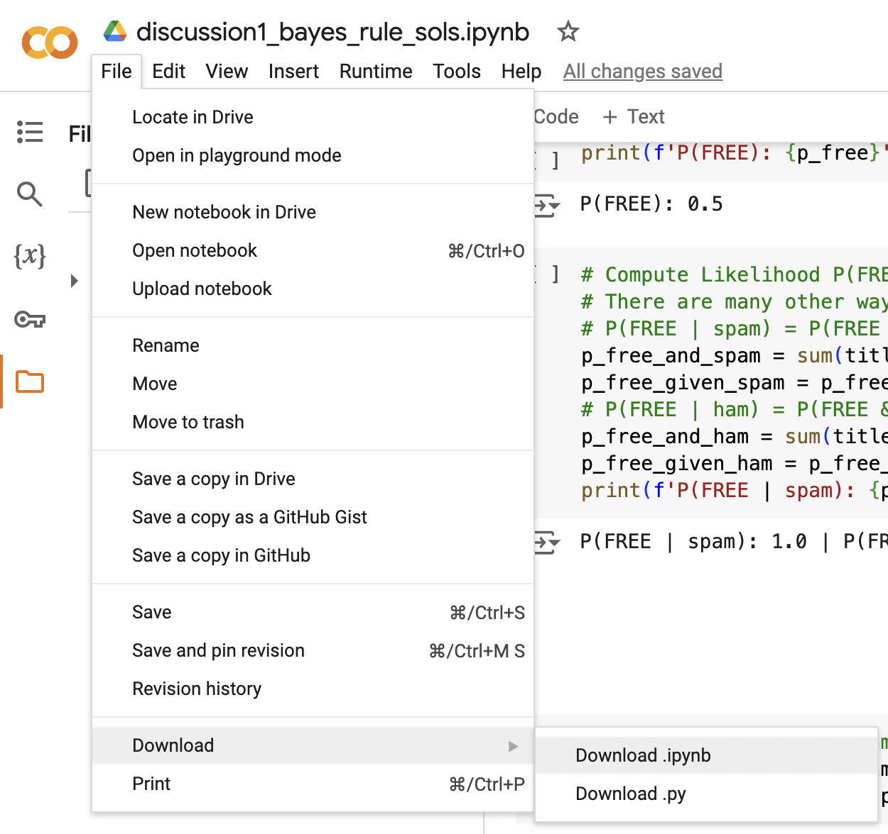
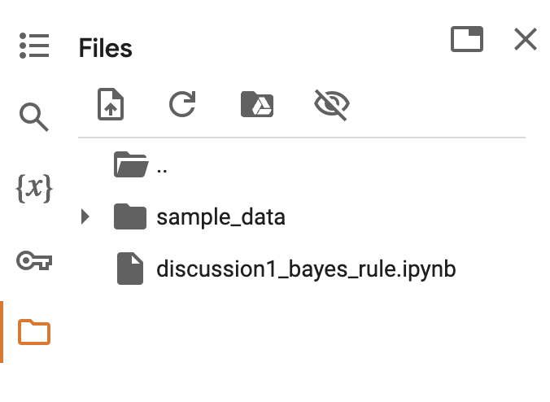

# Jupyter Notebook Export Tutorial

For many assignments in this class, you will need to export a Jupyter Notebook
for submission to Gradescope. Here is a tutorial on how to do so:

## Step 1: Download the notebook file



Go to `File > Download > Download .ipynb` and download the notebook file. It is
important that you complete this step before step 2 so that `apt-get` and `pip`
do not clog up your submission.

## Step 2: Install tools on Colab

Create and run the following cell:

```python
!apt-get install texlive texlive-xetex texlive-latex-extra pandoc
!pip install pypandoc
```

## Step 3: Upload the notebook back to the directory filesystem

Re-upload the notebook to Google Colab's filesystem, either by drag and dropping
on the files tab or clicking the upload button. Your files tab should now look
something like this:


## Step 4: Create and download the pdf

Create and run the following cell, replacing `discussion1_bayes_rule` with the
name of the notebook you uploaded:

```python
!jupyter nbconvert --to pdf discussion1_bayes_rule.ipynb
from google.colab import files
files.download('discussion1_bayes_rule.pdf')
```

The pdf should automatically be downloaded to your computer. All done!