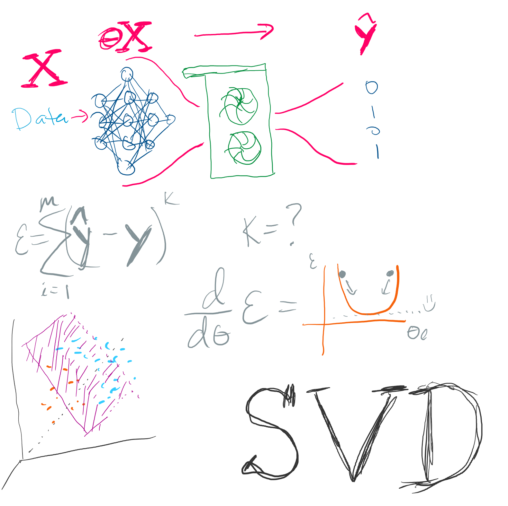

# UCSD CSE151A Summer Session II 2025 Syllabus and Logistics

- [Edwin Solares](http://edwinsolares.com) (Instructor)

[Basics](#basics) -
[Schedule](#schedule) -
[Course Components](#syllabus) -
[Staff &amp; Resources](#staff-resources) -
[Grading](#grading) -
[Policies](#policy)

Machine learning has become one of the fastest growing and most interesting subfields of artificial intelligence and computer science. Although machine learning has been part of our daily lives for some time now, it's presence and power has become unprescedented. Machine learning will continue to evolve and revolutionize how we interact with machines, ourselves and the world around us. 

In this course, we'll explore a number of **Machine learning concepts and techniques** that are used commonly by developers in their day-to-day work. You'll learn how to interpret and analyze data, identify targets and plan your machine learning pipeline. This means selecting good/appropriate models and loss functions for training based on your data and goal. We will start with supervised learning (Regression, Classification), go over various loss functions and gradient descent optimization approaches, cover unsupervised learning (Dimensional reduction, clustering, etc), and end with neural networks (including convolutional neural networks). If there is enough time, we will go over a special topics lecture.

This web page serves as the main source of announcements and resources for the course, as well as the syllabus.

## Basics

- Lecture: [Center Hall 113](https://map.concept3d.com/?id=1005#!ct/18312,63891,65653?m/163044?s/center%20hall), Monday through Thursday 8:00a-9:20a 
- Discussion: [Center Hall 113](https://map.concept3d.com/?id=1005#!ct/18312,63891,65653?m/163044?s/center%20hall), Friday 9:00a-10:50a
- “Skill Assessments” Exams: Flexible scheduling in weeks 2, 3, 4 and 5
  - [Prairie Test Link](https://us.prairietest.com/) - signing up and taking the skill assessments
  - [Prairie Learn Link](https://us.prairielearn.com/pl/login) - practice skill assessments
- Final Exam (used for making up test credit): Flexible scheduling at the end of the quarter on the end of week 5. Maximum of 1 Make up for Skill Assessments.

- Podcasts: [podcast.ucsd.edu](https://podcast.ucsd.edu)
- General Class Q&A Forum: Discord link on Canvas!
- Code Q&A Forum: [Piazza](https://piazza.com/)
- Gradescope: [https://www.gradescope.com](https://www.gradescope.com)
- Textbook/readings: There's no official textbook, but we will link to
  different online resources for you to read to supplement lecture. There are a few good general overall resources if you want others to peruse, but these aren't required:
  - The first is available as an e-book through the library website; the rest are on reserve at Geisel:
    - Trevor Hastie, Robert Tibshirani, and Jerome Friedman, The elements of statistical learning (2nd edition).
    - Gilbert Strang. Linear algebra and its applications .
    - Kevin Murphy, Machine learning: a probabilistic perspective.
    - Richard Duda, Peter Hart, and David Stork, Pattern classification (2nd edition).
  - Above resources are from Dr. Dasgupta
  - Free: [MIT Missing Semester](https://missing.csail.mit.edu/)
- Data Repositories:
  - [UCI Machine Learning Data Repo](https://archive.ics.uci.edu/ml/index.php)
  - [Tensorflow Datasets](https://www.tensorflow.org/datasets/catalog/overview#all_datasets)
  - [Kaggle Datasets](https://www.kaggle.com/datasets)

## Office Hours Calendar
<iframe src="https://calendar.google.com/calendar/embed?height=600&amp;wkst=1&amp;mode=WEEK&amp;src=c_aa96475faffcfb251ca3f869090c058c1e21601ad231d11e60140a04d567f182%40group.calendar.google.com&ctz=America%2FLos_Angeles" style="border: 0" width="800" height="600" frameborder="0" scrolling="no"></iframe>

## Schedule

The schedule using the left side navigation bar outlines topics, due dates, and links to assignments. The
schedule of lecture topics might change slightly, but I post a general plan so
you can know roughly where we are headed. If you do not see the weeks listed on the left, click the hamburger icon in the top left to reveal it.

## Syllabus

There are several components to the course:

- **Discussion sessions**
- **Lecture sessions**
- **Weekly quizzes**
- **Homework/PAs**
- **Skill assessments**
- **Group project**

### Discussion

The course's discussion component meets for an hour every Friday. In each discsussion you'll switch between working on your own, working in pairs, and participating in group discussions about your approach, lessons learned, programming problems, and so on. Please bring your laptop to code and follow along.

The discussion sessions will be led by TAs and tutors, who will note your
participation in these discussions for credit. At the end of the day you will submit your work to show participation.

If you miss discussion, you'll still be held accountable for understanding the
relevant material via Skill Assessments. You can miss 1 discussion submission
without it impacting your grade (see [Grading](#grading) below). There is no
way to make up a dicussion, even for illness, travel, or emergencies. My preference would be to require all 10 discussions for an A, and have some kind of excused absences. However, tracking excused absences doesn't really scale, so the “one for any reason” policy is how we handle it. You don't need to justify your missed discussions. Contact the instructor if you'll miss more than one discussion for unavoidable reasons.

### Lecture Sessions

Lecture sessions are on Monday, Wednesday, and Friday.

In each lecture, we will go over Jupyter Notebooks (available electronically via GitHub). At the end of lecture you'll have a chance submit your Jupyter Notebook to Gradescope. You can do this by uploading your ipynb file via the Gradescope app (for iOS and Android) or
through the web interface. To get participation credit for lecture, you have to
submit a handout filled in with reasonable effort. It's fine if answers aren't
right, and some days don't have right answers. It's fine if things aren't
totally complete, and some days we won't finish everything. But it should be
clear from what you submit that you followed along and worked on the exercises we did in class.

If you miss class, you can submit them up until the start of the next class as
late submissions.  We recommend completing them while watching the podcast.
We'll have TAs/Tutors on hand to help with questions during lecture and to help with submitting work to Gradescope. See [Grading](#grading) below for the
required submissions and how that impacts your grade.

### Weekly Quizzes

Each week there will be an online, untimed, multiple-tries quiz on PrairieLearn. Deadlines for the quizzes can be found on PrairieLearn. Note: **For on time submission, it must be submitted prior to the deadline, regardless of the reason**. The purpose of this quiz is to make sure everyone has checked in on the concepts. They are open for late submission until the end of the quarter, but
see grading below for how late submissions correspond to grades.

Sometimes quizzes have associated readings or videos to supplement lecture.

### Homeworks

Homeworks will be released usually every other week and you will typically have two weeks to submit via Gradescope the pdf file **(Note: Not an ipynb!)**. Note that hw 5 will have only one week to complete. The homework will be due on Sundays, the day before the next homework is released. Homework will only be graded on your ability to complete the assignment based on the directions, and not based on accuracy of your model (unless specified), but must be above random. I highly recommend coding your own ML algorithmic implmentations and using libraries only for checking your work. This will greatly help you for your skill assessments, as you will be expected to code core ML algorithms without imports. The only imports allowed for Skill Assessments are numpy and pandas.

For each post, our staff will review it and give a **0-4** score along with feedback. This values will be based on thresholding your points:

- **4** for a complete submission of professional quality that covers all the expectations listed in the directions (Generally Points >= 90)
- **3** for a complete submission with some mistakes, some unclear writing, or some confusing or nonstandard formatting (Generally Points >= 80)
- **2** for a complete submission with major mistakes, some unclear writing, or some confusing or nonstandard formatting (Generally Points >= 70)
- **1** for a submission missing key components, or clear inaccuracies in multiple components (Generally Points >= 60)
- **0** for no submission, a blank submission, or a submission of something irrelevant (Generally Points < 60)

After each homework (**except the last homework**) is graded, you'll have a chance to *resubmit* it based on the feedback you received, which will detail what you need to do to increase your score. Once the homework is graded and returned with feedback, the resubmission period (max of one week) will be opened.

- For an original score of **0**, you can raise your score up to **2** (but not to **3** or **4**)
- For an original score of **1**, you can raise your score up to **3** (but not to **4**)
- For an original score of **2**, you can raise your score up to **4**

This is also the only late policy for homework. Unsubmitted reports are initially assigned a **0**, and can get a maximum of **2** points on resubmission. **Only** one homework will be dropped. This is the only policy for excused homework regardless of the reason. **NO LATE SUBMISSIONS WILL BE ACCEPTED!!! PERIOD!**

### Skill Assessments

Several times during the quarter, you will complete a _skill assessment_
-- this course's version of exams. You'll be given a jupyter notebook environment to practice on in advance. The practice problems will not be similar to the first skill assessment and will only be there to demonstrate the structure and environment.

On each you will have an autograder with 4 or more questions and 40 minutes to complete each assessment. The skill assessments will start on week 2 and continue for weeks 3, 4 and 5. You will be able to choose a scheduled time each week on the PrairieTest website. On the day of your assessment you must bring a valid picture ID. Only one paper notesheet front and back will be allowed.

Skill assessments will take place in AP&M, **unless you have an AFA letter**. You must schedule a time to take your exams in advance. To do this, visit prairietest.com and log in with your UCSD-associated Google account. From there, you will be able to see the exams available for reservation.

Students requesting accommodations for this course due to a disability must provide a current Authorization for Accommodation (AFA) letter (paper or electronic) issued by the Office for Students with Disabilities (osd.ucsd.edu). Students are required to discuss accommodation arrangements with instructors and OSD liaisons in the department IN ADVANCE of any exams or assignments. Students with approved accommodations will be taking their exams at the Triton Testing Center and not prairietest.com. Exams must be scheduled at least 72 hours in advance at http://tritontesting.ucsd.edu.

### Group Projet
The group project is milestone based and will consist of several milestones. Work will be uploaded on GitHub and submissions will be done on Gradescope. Details on Canvas, and submission details on Gradescope! 
Note: Students will get to choose their group partners at **every submission***. This allows students to vote out deadbeat partners that do not participate in the submission.

## Grading

In order to get an A in the class it is recommended that you get an A in each component of the course. A+'s will be assigned at the end of the quarter and only to students showing exemplary accomplishments across all components of the course, and have shown strong collaboration with their peers.

A table that contains the grading scheme data. Each row contains a name, a maximum percentage, and a minimum percentage.

| Letter | Grade	Range |
| --- | --- |
A	| 100% to 94%
A-| < 94% to 90%
B+| < 90% to 87%
B | < 87% to 84% 
B-| < 84% to 80% 
C+| < 80% to 77% 
C | < 77% to 74% 
C-| < 74% to 70%
D |< 70% to 60% 
F | < 60%
**Note: A+'s will be limited and given out at the end of the quarter to the highest scoring students prior to drops, resubmissions and makeups**

The weighted breakdown of each category is as follows:

| Category | Percentage |
| --- | --- |
Lecture Participation | 7%
Discussion Participation | 3%
Quizzes | 10%
Homeworks | 15%
Group Project | 30%
Skill Assessments | 35%

## Policy

## Academic Integrity

Individual assignments describe policies specific to the assignment. Some
general policies for the course are here.

### Homework + Group Projects and Academic Integrity

You can use code that we provide or that you develop. All of the *writing* must be your own.

You **can** use an AI assistant like ChatGPT or Copilot to help you write code in this class. If you do, you are **required** to include
it in the collaboration section that shows:

- The prompts you gave to ChatGPT, or the context in which you used Copilot
  autocomplete
- What its output was and how you changed the output after it was produced

This helps us _all_ learn how these new, powerful, and little-understood tools
work (and don't).

### Skill Assessments and Academic Integrity

General instructions for skill assessments (not the questions) will be posted in week 1 and will be the same for subsequent skill assessments.
You're free to collaborate with others on preparing for
the skill assessments, trying things out beforehand, and so on.

However, you **CANNOT** share details of _your_ skill assessment with others until the following Saturday. You **CANNOT** communicate with anyone during the week of that skill assessment. i.e. Skill assessment 1 cannot be discussed during the entirety of week 2 and so forth.

### Quizzes and Academic Integrity

You can work on weekly quizzes with other students.

## Anticipated Frequent Questions

**Can I attend a skill assessment session other than the one I have signed up for?**

No, you will be turned away. You must reschedule your skill assessment 30 minutes prior to it starting to attend another time.

**What do I need to do to get an A?**

See the grading section above.

**Can I leave discussion early if I'm done?**

The discussions are designed to not be things you can “finish”. Discussions have plenty of
extension and exploration activities at the end for you to try out, discuss,
and help one another with. Co-located time with other folks learning the same
things is precious and what courses are for. Also, if you need an extrinsic
motivation, you won't get credit for participation if you don't stay, and
participate, the whole time.

**Do I have to come to discussions?**

Yes, see grading above.

**What should I do if I'm on the waitlist?**

Attend and complete all the work required while waitlisted (this is consistent
with [CSE
policy](https://cse.ucsd.edu/undergraduate/courses/enrolling-cse-courses)).

**I missed lecture/have to travel for a lecture, what should I do?**

Find the associated notebook for the week above, watch the
[podcast](https://podcast.ucsd.edu), and hand in the notebook ipynb file to Gradescope before the next class.

**I missed the late deadline for a lecture handout submission, what should I do?**

You cannot submit a lecture handout after the posted deadline on Gradescope;
move on and focus on getting to the next ones!

**I missed discussion, what should I do?**

You cannot makeup missed discussion credit (but have a few “allowed” misses). Make
sure you understand the material from discussion because it will be used on skill
assessments; try to do the parts that don't involve discussion on
your own, and review your group's discussion notes. This is why it's good to make new friends in my classes. :)

**I missed a quiz deadline, what should I do?**

You can submit it late until the end of the quarter. Generally we allow lots
(think like 1/3 to 1/2) of the quizzes to be late without it impacting your
grade, but do take them seriously before the end of the week so you're prepared.

**I missed a homework deadline, what should I do?**

A week after each homework deadline there is a late/resubmission deadline (except for the last homework).
You can resubmit then. See the homework section above for grading details
about resubmissions.

**I missed a homework resubmission deadline, what should I do?**

You cannot get an extension on homework resubmissions; we cannot support
multiple late deadlines and still grade all the coursework on time.

**I missed my skill assessment time, what should I do?**

Stay tuned for announcements about scheduling a make-up later in the quarter.

**Where is the financial aid survey?**

We do this for you; as long as you submit a quiz, lecture handout, or do a lab
participation in the first week, we will mark you as commencing academic
activity.

